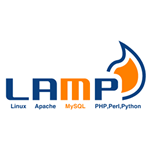

#Installing LAMP

## What is LAMP


LAMP is a collection software that is used to serve webpages over a network. 

## Installation

Installation is relatively straightforward, if you're logged in as the default user on your Raspbian-based Pi simply use apt-get:

```bash
    sudo apt-get install apache2 php5 php5-mysql mysql-server
```


In the image above I'm using the Pi as the super user, or root, so the `sudo` potion can be omitted. 

## Apache


The Apache Server is a popular, open-source server that transmits data between computers on a network using **H**yper **T**ext **T**ransfer **P**rotocol or HTTP. 

More information on the project can be found on the <a href="http://httpd.apache.org/" target="_blank">Apache website.</a>

## MySQL


**S**tructured **Q**uery **L**anguage or SQL (usually pronounced "sequel") is a simple language used for working with databased. 

More information on the open source MySQL project can be found on <a href="http://www.mysql.com/" target="_blank">their website</a>

## PHP


**P**HP: **H**ypertext **P**rocessor, or PHP, is a scripting language that is used to render webpages on a server and then serve them to a visitor via their web browser.

PHP files can typically be identified by the `.php` file extension.