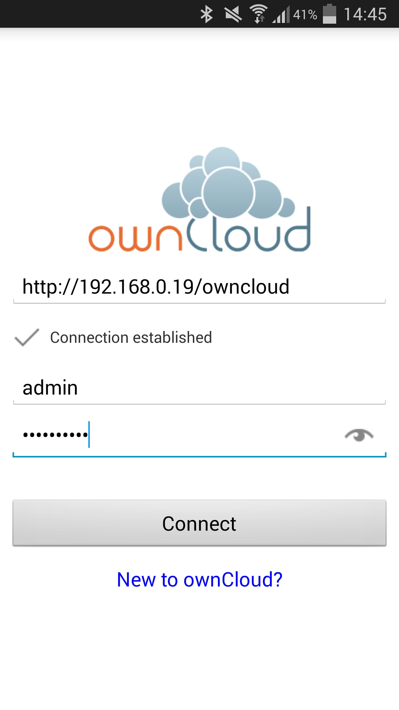

# Cloud Storage

Early hard drives were heavy, expensive, slow, and well, not particularly capacious. The advent of cheap storage in recent year has however lead to a proliferation of cloud storage providers. Services like Dropbox, Google Drive, and One Drive will now store Gigabytes of your data for free and for a small fee will give you access to even more storage. With a little bit of effort you can create your own cloud storgae service. Conveniently enough, the service we'll use is called ownCloud.

## ownCloud

Like most things in the Raspberry Pi world, ownCloud is open source software so you can customise and configure it to your heart's content. You can find lots more information on the <a href="https://owncloud.org/" target="_blank">ownCloud website</a> but the best way to understand something is by experienceing it so to do that you can visit the <a href="http://demo.owncloud.org" target="_blank">ownCloud demo.</a> By the end of this section you should have an instance of ownCloud running on your Raspberry Pi, and your information should be accessible through any browser or through an app.

## Installation

There are a few steps we need to go through the get all the software up and running on our Pi. In a nutshell we'll be going through the following steps:

- Add ownCloud to our repositories
- Generate a public key for securing transmitting data
- Add the key to our collection of release keys
- apt-get install ownCloud
- Configure a database
- Start ownCloud and connect it to our database
- Access ownCloud via mobile app [optional]
- Extend ownCloud functionality with apps

## Setup

#### Add Repository

First of all you have to add the ownCloud repository to our _apt_ repository. Create an owncloud.list file in the terminal by entering the following:

```
sudo nano /etc/apt/sources.list.d/owncloud.list
```
 

Once opened add the following line. Note the space between the two forward slashes at the end of the line.

```
deb http://downloads.opensuse.org/repositories/isv:ownCloud:communty/Debian_7.0/ /
```

Then save and exit nano.


#### Add Public Key

Next we need to generate our public key using webget. Using the same repository as before enter this command:

```
wget http://download.opensuse.org/repositories/isv:ownCloud:community/Debian_7.0/Release.key
```


Once the key is generated, add it to _apt-key_ with the folling line:

```
 sudo apt-key add - < Release.key
```


#### Update and Install

We're almost there, just run the following two command to update you Pi and install ownCloud

```
 sudo apt-get update
 sudo apt-get install owncloud
```


## Create Database

#### Login to MySQL and create a Database


## Web Browser

####Log In 

## Mobile App

Own Cloud & Blaucloud




## Apps

## Troubleshooting

